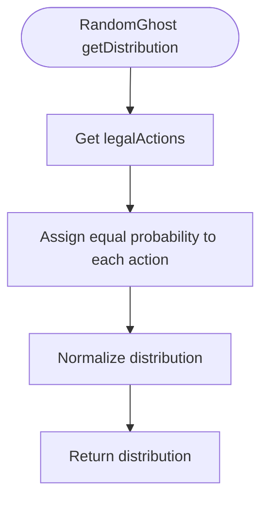

```mermaid
graph TD
    RG_Start([RandomGhost getDistribution])
    RG_A[Get legalActions]
    RG_B[Assign equal probability to each action]
    RG_C[Normalize distribution]
    RG_D[Return distribution]
    
    RG_Start --> RG_A --> RG_B --> RG_C --> RG_D
```