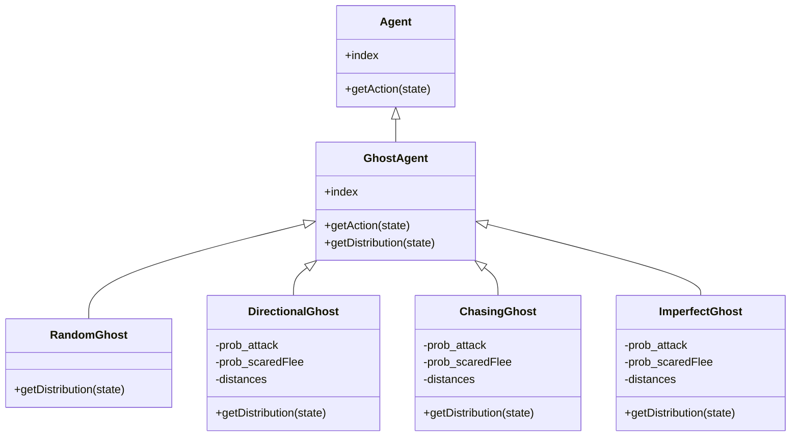

```mermaid
classDiagram
    class Agent {
        +index
        +getAction(state)
    }

    class GhostAgent {
        +index
        +getAction(state)
        +getDistribution(state)
    }

    class RandomGhost {
        +getDistribution(state)
    }

    class DirectionalGhost {
        -prob_attack
        -prob_scaredFlee
        -distances
        +getDistribution(state)
    }

    class ChasingGhost {
        -prob_attack
        -prob_scaredFlee
        -distances
        +getDistribution(state)
    }

    class ImperfectGhost {
        -prob_attack
        -prob_scaredFlee
        -distances
        +getDistribution(state)
    }

    Agent <|-- GhostAgent
    GhostAgent <|-- RandomGhost
    GhostAgent <|-- DirectionalGhost
    GhostAgent <|-- ChasingGhost
    GhostAgent <|-- ImperfectGhost
```

