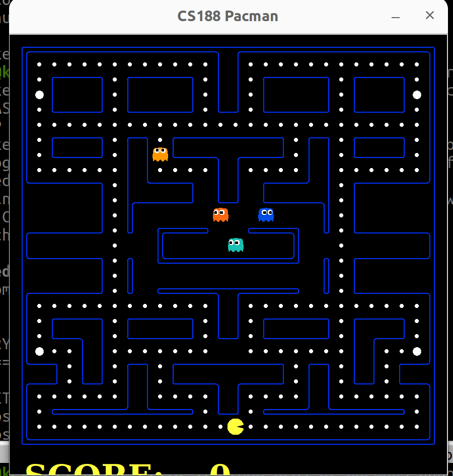

本專案整合自 UC Berkeley Pacman 專案，修改後支援 **Behavior Tree (BT)** 結構的鬼 (`ghost_bt.py`)，
並在執行時自動載入四隻不同行為的鬼：
BTRandomGhost 
BTDirectionalGhost 
BTChasingGhost 
BTImperfectGhost 

Pacman 則維持以鍵盤方向鍵 (或 WASD) 操作。

---

## 執行環境

本專案設計於 Docker + ROS 環境下運行。請確認：
你已有 `docker_run.sh`、`docker_join.sh`、`environment.sh`
並已成功建置 ROS 容器與 Pacman 專案

---

## 執行方式

以下為完整執行步驟：

### Terminal 1：
```bash
cd oop-proj-bt-pacman
source docker_run.sh
source environment.sh
roscore
```

### Terminal 2：
```bash
cd oop-proj-bt-pacman
source docker_join.sh
source environment.sh
cd pacman_game
python3 pacman.py -l originalClassic -p KeyboardAgent
```

---

## 遊戲說明

**操作方式**： 
方向鍵 或 WASD 控制 Pacman 
**遊戲內容**： 
畫面中共有 4 隻鬼，分別由 `ghost_bt.py` 控制 
鬼行為為行為樹（Behavior Tree）驅動，包含隨機、方向性、追逐、不完美等策略 
**勝利條件**：吃光所有豆子 
**失敗條件**：被鬼抓到 

---

##  專案結構

```
pacman_game/
│
├── pacman.py          # 主程式（整合四隻 BT 鬼）
├── ghost_bt.py        # Behavior Tree 鬼行為實作
├── layouts/           # 地圖檔案（originalClassic 推薦）
├── game.py            # 遊戲核心邏輯
├── graphicsDisplay.py # 圖形介面
└── util.py, layout.py, textDisplay.py 等輔助模組
```


##  範例畫面



